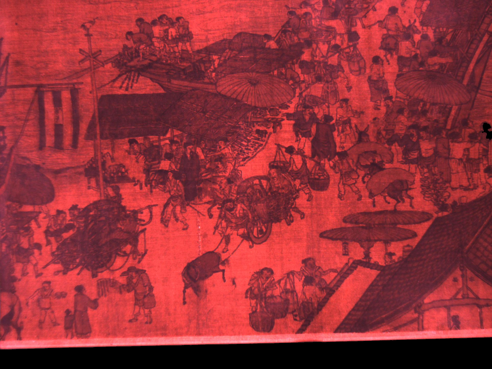
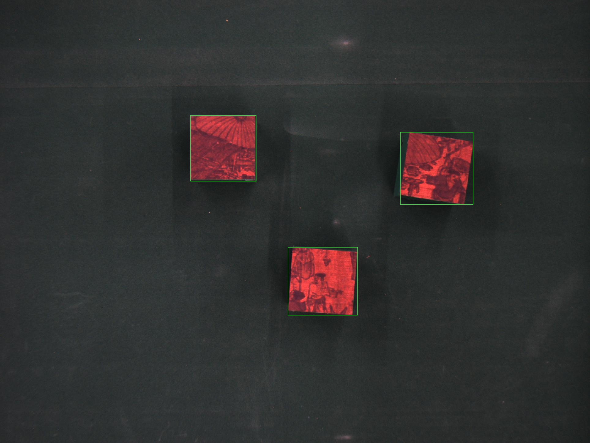
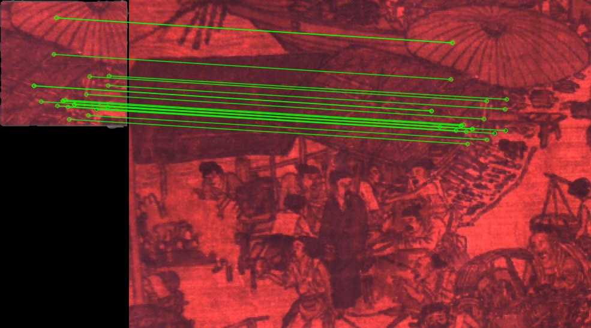

# picture-puzzle-matching
基于SIFT算法的拼图匹配

### 一、安装依赖
* Python 3
* Numpy
* opencv-python=3.4.2.17

推荐使用Anaconda创建Python虚拟环境运行代码
Anaconda下载地址：https://www.anaconda.com/products/individual

创建虚拟环境：`conda create -n your_env_name python=3.7`

激活虚拟环境：`conda activate your_env_name`

退出虚拟环境：`conda deactivate`

激活虚拟环境后，安装依赖：`pip install -r requirements.txt`

**注意：如果原环境中已经安装了更高版本的opencv-python，请先卸载原有的版本`pip uninstall opencv-python`**

## 二、拼图匹配
### 运行测试程序

在项目根目录下，运行：

```bash
python detect_and_matching.py
```
### 运行结果
目标拼图：

散乱拼图：

匹配结果：



